# Frontend Project - Scuffed Webstore

## Introduction

This project uses React and Redux (among other things) to provide a web store frontend\
with https://noutaja-scuffed-webstore.azurewebsites.net/ serving as the backend.
It is still a work in progress.

## Table of contents

-   [Getting started](#getting-started)
    -   [Development](#development)
    -   [Deploying the site](#deploying-the-site)
-   [Usage](#usage)
    -   [Features](#features)
    -   [Using the site](#using-the-site)
    -   [Scripts](#scripts)
-   [Architechture and design](#architecture-and-design)
    -   [Technologies](#technologies)
    -   [File structure](#file-structure)
    -   [Design and Structure](#design-and-structure)
-   [Testing](#testing)
-   [Assignment](#assignment)
    -   [Features and todo list](#features-and-todo-list)
-   [Online version](#online-version)

# Getting started

## Development

1. Use `git clone https://github.com/Noutaja/fs16_6-frontend-project.git` to download the files
2. Use `npm install` to install all dependancies
3. Use `npm start` to run the project locally

## Deploying the site

1. Use `npm install` if you haven't already
2. Edit `"homepage": "https://noutaja.github.io/fs16_6-frontend-project/"`\
   to match your profile- and repository name. **IMPORTANT!**
3. Use `npm run deploy`
4. Edit your github pages setting:
   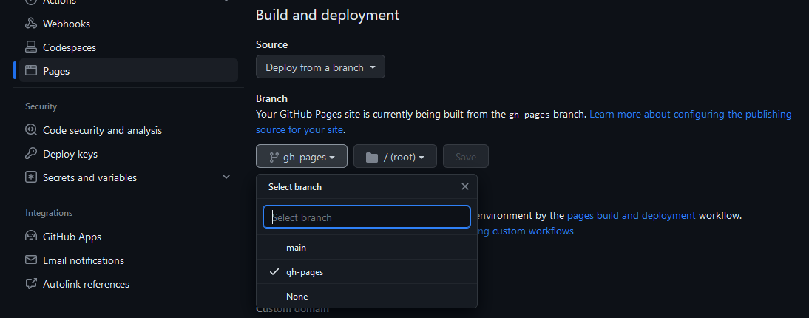

# Usage

## Features

Scuffed Webstore features a responsive user interface with basic product searching and sorting:
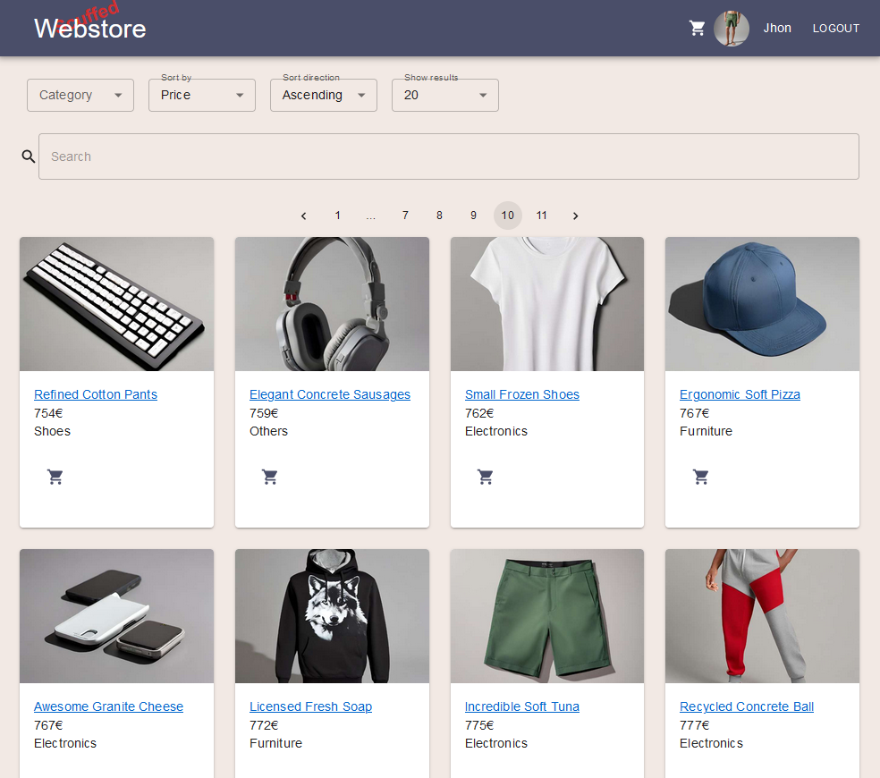

Store at tablet and beyond

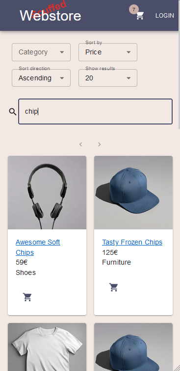

Store with mobiles

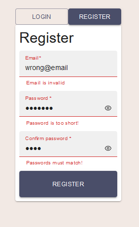

Logging in has input validation

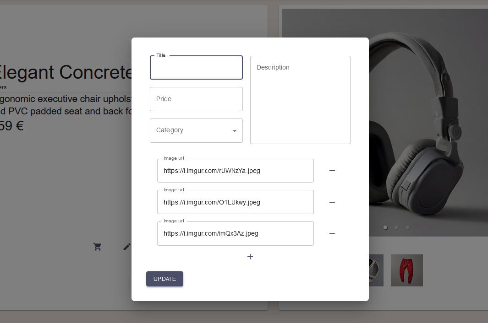

Editing and adding a product is a modal

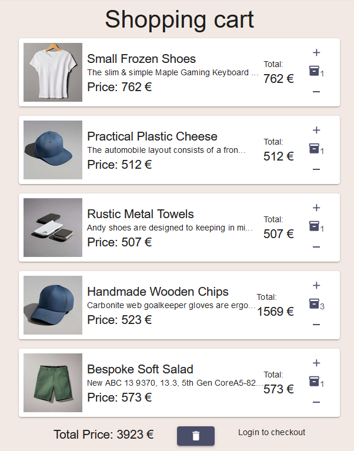

Shopping cart checks if the user is logged in before checking out

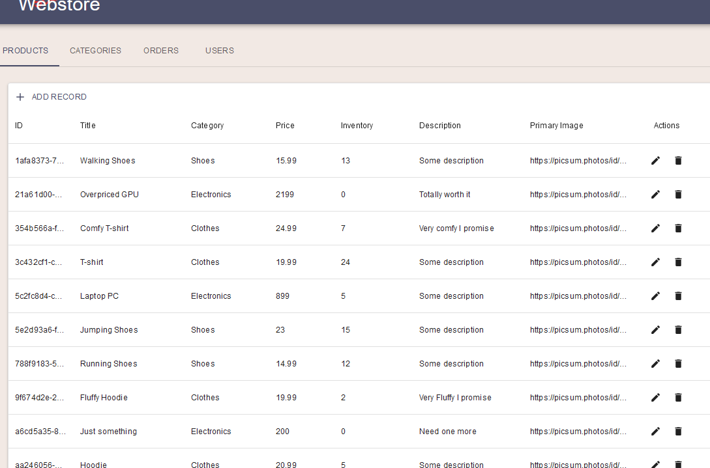

Admin dashboard allows viewing, editing and adding of Products, Categories,\
User and Orders.

## Using the site

Using the site as a user is intuitive and doesn't need much explanation.\
Usage follows normal conventions.

### As admin

As an admin, you get access to a few additional features:

#### Adding new products

This is accessed in the main product view after logging in with an admin account.
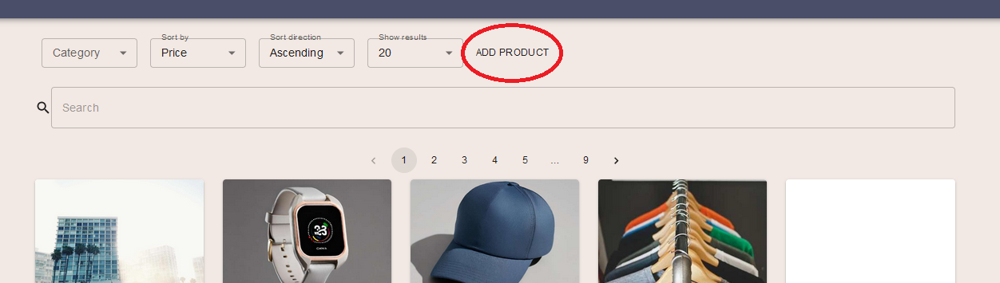

This opens a modal form you can fill in. All fields are required, and at least one\
url must be provided for an image.

#### Editing a product

This feature can be found in the single product view. It is a button next to the\
add to cart button. It opens up the same modal form as adding a product,\
but none of the fields are required, except one url must still be provided.

#### Deleting a product

This is done via a button next to the edit product button. Deletion is instant,\
and doesn't have confirmation (yet).

## Scripts

### `npm run deploy` and `npm run predeploy`

`npm run deploy` is used to publish the project to your set homepage.\
`npm run predeploy` is called automatically by `npm run deploy`.

### `npm install`

Install all the dependencies

### `npm start`

Runs the app in the development mode.\
Open [http://localhost:3000](http://localhost:3000) to view it in the browser.

The page will reload if you make edits.\
You will also see any lint errors in the console.

### `npm test`

Launches the test runner in the interactive watch mode

### `npm run build`

Builds the app for production to the `build` folder.\
It correctly bundles React in production mode and optimizes the build for the best performance.\
Use this if you want to publish the site somewhere not Github Pages. It may require additional tweaks.

# Architecture and design

## Technologies

-   TypeScript
-   React
    -   React-router-dom
-   Redux
-   Jest
-   MSW
-   Material UI

## File Structure

Horizontal layout

```
.
├── package-lock.json
├── package.json
├── public
|  ├── favicon.ico
|  ├── ...
|  └── robots.txt
├── README.md
├── src
|  ├── App.tsx
|  ├── components
|  |  ├── CartItemComponent.tsx
|  |  ├── ...
|  |  └── StoreLogo.tsx
|  ├── componentsCustom
|  |  └── UnstyledLink.tsx
|  ├── helpers
|  |  ├── addIdsToList.ts
|  |  ├── ...
|  |  └── searchSorting.ts
|  ├── hooks
|  |  ├── useAppDispatch.ts
|  |  └── useAppSelector.ts
|  ├── index.tsx
|  ├── pages
|  |  ├── CartPage.tsx
|  |  ├── ...
|  |  └── SingleProductPage.tsx
|  ├── react-app-env.d.ts
|  ├── redux
|  |  ├── reducers
|  |  └── store.ts
|  ├── tests
|  |  ├── cartReducer.test.ts
|  |  ├── ...
|  |  └── usersTestServer.ts
|  ├── themes
|  |  └── themes.ts
|  └── types
|     ├── Props.ts
|     └── Types.ts
└── tsconfig.json
```

## Design and Structure

### Project Structure

Project structure diagram

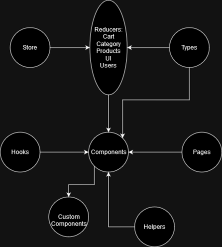

The project is built around the 5 reducers (more detail below)\
despite the diagram showing the opposite. The reducers hold all\
the important data and provide it globally. Pages are mostly\
comprised of different components that access the reducers\
to show data. The components use two hooks, useAppDispatch and\
useAppSelector, to do so. A few utility functions reside in the helpers\
folder.

#### Reducers

Reducers are the heart of the website, ProductReducer being the most important.\
They have both synchronous and asynchronous functions. The Asynchronous\
functions connect to the API to fetch online data.

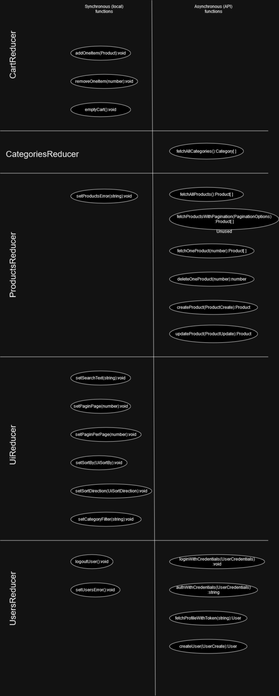

Reducers diagram

##### CartReducer

Handles the cart. Mostly complete.

-   Synchronous functions
    1. `addOneItem(Product):void`
    2. `removeOneItem(uuid):void`
    -   Is provided the id of the item
    3. `emptyCart():void`

##### CategoriesReducer

Holds the categories fetched from the API. Only basic functionality present.

-   Asynchronous functions
    1. `fetchAllCategories():Category[]`
    2. `fetchCategoriesWithPagination():Category[]`
    -   Currently unused, used in the future
    3. `fetchOneCategory(uuid):Category[]`
    -   Is provided the id of the item
    -   Returns the category IN AN ARRAY
    4. `deleteOneCategory(uuid):uuid`
    -   Is provided the id of the item
    -   Returns the Id back if successful
    5. `createCategory(CategoryCreate):Category`
    -   Is provided the new category, and a Bearer authorization token
    -   Returns the new category
    6. `updateCategory(CategoryUpdate):Category`
    -   Is provided the updated category, its id, and a Bearer authorization token

##### ProductsReducer

The core of the website. Keeps all products fetched from the API. Finished.

-   Synchronous functions
    1. `setProductsError(string):void`
    -   Used to clear errors
-   Asynchronous functions
    1. `fetchAllProducts():Product[]`
    2. `fetchProductsWithPagination(PaginationOptions):Product[]`
    -   Currently unused, used in the future
    3. `fetchOneProduct(uuid):Product[]`
    -   Is provided the id of the item
    -   Returns the product IN AN ARRAY
    4. `deleteOneProduct(uuid):uuid`
    -   Is provided the id of the item
    -   Returns the Id back if successful
    5. `createProduct(ProductCreate):Product`
    -   Is provided the new product, and a Bearer authorization token
    -   Returns the new product
    6. `updateProduct(ProductUpdate):Product`
    -   Is provided the updated product, its id, and a Bearer authorization token

##### UiReducer

Holds variables for the UI.

-   Synchronous functions
    1. `setSearchText(string):void`
    -   Current search text
    2. `setPaginPage(number):void`
    -   Pagination page number
    3. `setPaginPerPage(number):void`
    -   Number of items on a search page
    4. `setSortBy(UISortBy):void`
    -   Sorting parameter
    5. `setSortDirection(UiSortDirection):void`
    -   Sorting direction
    6. `setCategoryFilter(string):void`
    -   Category filtering. The search box provides one additional category\
        to show all categories.

##### UsersReducer

Handles users and authentication. Currently mostly authentication.

-   Synchronous functions
    1. `logoutUser():void`
    2. `setUsersError(string):void`
-   Asynchronous functions
    1. `authWithCredentials(UserCredentials):string`
    -   Checks email and password against the API. Returns an access token if valid.
    2. `fetchProfileWithToken(string): User`
    -   Takes the token from above, checks it with the API and returns a User if valid.
    3. `LoginWithCredentials(UserCredentials):User`
    -   Calls the two functions above. Does nothing more.
    4. `createUser(UserCreate):User`
    -   Is provided the new user
    -   Returns the new user
    5. `fetchAllUsers(UserGet):User[]`
    -   Is provided a Bearer authorization token
    6. `fetchUsersWithPagination(PaginationOptions):User[]`
    -   Currently unused, used in the future
    7. `fetchOneUser(uuid):User[]`
    -   Is provided the id of the item
    -   Returns the user IN AN ARRAY
    8. `deleteOneUser(uuid):uuid`
    -   Is provided the id of the item, and a Bearer authorization token
    -   Returns the Id back if successful
    9. `updateUser(UserUpdate):User`
    -   Is provided the updated item, its id, and a Bearer authorization token
    -   Returns the User
    10. `updateUserRole(UserRoleUpdate):User`
    -   Is provided the updated role, its id, and a Bearer authorization token
    -   Returns the user

### Page Structure

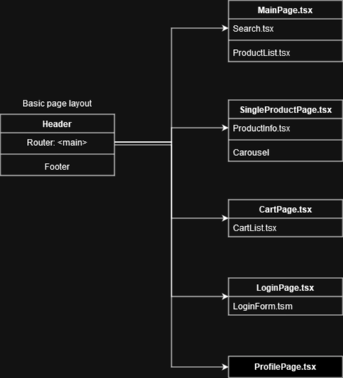

Page structure diagram

# Testing

Uses React's built in testing methods([Jest](https://jestjs.io/)) in addition\
with a mock server ([Mock Service Worker](https://mswjs.io/)). For now only\
the reducers and their the positive tests (things going as planned) are done,\
with a few exceptions. UsersReducer is tested to not log in with incorrect credentials.

## Running the tests

1. Use `npm install` if you haven't already
2. Use `npm test` to start the tests. The first run may take longer.

# Assignment

## Requirements

1. Use the API endpoint https://fakeapi.platzi.com/ to create an e-commerce website.\
   Read the documentation and learn how to use the different endpoints.
2. Create at least 4 pages (can be more if you want): Page for all products, product page,\
   profile page (only available if user logins), and cart page (cart page could be a page or a modal)
3. Create Redux store for following features:

-   product reducer: get all products, find a single products, filter products by categories,\
    sort products by price. Create, update and delete a product\
    (enable create, update and delete features only for admin of the webapp)
-   user reducer: register and login
-   cart reducer: add product to cart, remove products, update products's quantity in cart

4. When adding routers to your application, programatically set certain routes to be private.\
   For example, route to user profile page should not be accessible if user has not logged in.
5. Implement unit testing for the reducers
6. Deploy the application and rewrite README file.

## Bonus

1. Use context API to switch theme
2. Use pagination when fetching/displaying all the products
3. Implement performance optimization where applicable

## Feature and Todo list

### Complete

-   Basic responsiveness
    -   Elements resize and hide with narrower screens
-   Custom theme
-   API
    -   Products
        -   Create
        -   Read
        -   Update
        -   Delete
    -   Categories
        -   Read
    -   Users
        -   Create
        -   Authenticate
-   Pages
    -   Products search
    -   Single product
    -   Cart
    -   Login and register
    -   Profile
-   Products page features
    -   Filtering
        -   Category
        -   Name
    -   Sorting
        -   Price
        -   Ascending and descending
    -   Client-side pagination
    -   Adding products to cart
    -   ADMIN: Add new product
-   Single Product page features
    -   Carousel
    -   ADMIN: Edit product
    -   ADMIN: Delete product
-   Cart page features
    -   Cart contents
    -   Increase and decrease product quantity
    -   Empty cart
    -   Login check for checkout
-   Login and register page features
    -   Form validation
-   Profile page features
    -   Basic information
    -   Gated from unregistered users

### Todo

-   Optimizations
    -useMemo for selectors
-   Proper responsiveness
    -   Menu for nav bar
    -   Do fonts better
    -   Fix various bugs
-   API
    -   Categories
        -   Create
        -   Update
        -   Delete
    -   Users
        -   Read
        -   Update
        -   Delete
    -   Google authentication
    -   Payment processing
-   Pages
    -   Checkout page
    -   Admin dashboard
-   Products page features
    -   Filtering
        -   Price
    -   Sorting
        -   Name
    -   Server-side pagination
        -   API might not support it
-   Cart page features
    -   Checkout details sidebar
-   Login and register page features
    -   Fix bugs
    -   Possibly split into two
-   Profile page features
    -   Updating information
    -   Order history
    -   Visual upgrades
-   **REFACTORING THE WHOLE THING**

# Online version

You can find an online version of the project [here](https://noutaja.github.io/fs16_6-frontend-project/)
